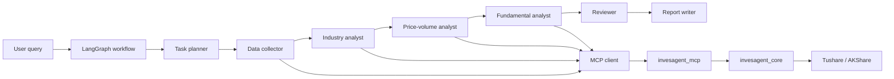

# InvesAgent

English | [中文](README.zh-CN.md)

InvesAgent is a local financial data and research-agent project. It is organized as two independent packages:

```text
InvesAgent/
  invesagent_mcp/     # Standalone MCP server + embedded finance core
  invesagent_agent/   # LangGraph research agents and workflow
```

> Disclaimer: This project is for data analysis, engineering practice, and learning only. It does not provide investment advice.

## What It Does

- Exposes financial data and analytics as MCP tools.
- Supports Tushare and AKShare data providers.
- Fetches OHLCV, valuation, fundamentals, trading calendar, industry list, and industry members.
- Generates configurable price charts.
- Runs a LangGraph research workflow through an MCP client.
- Uses role-specific prompts for task planning, price-volume analysis, fundamental analysis, industry analysis, report writing, and review.

## Package Roles

`invesagent_mcp` is the standalone MCP server. It embeds the finance core, so it can be copied and installed independently:

```text
invesagent_mcp/src/
  invesagent_core/    # models, providers, services, metrics, charts, storage, config
  invesagent_mcp/     # MCP server and MCP tool registration
```

`invesagent_agent` contains the Agent side:

```text
invesagent_agent/src/invesagent_agent/
  agents/             # LangGraph node implementations
  clients/            # MCP client and OpenAI-compatible LLM client
  prompts/            # role-specific prompts
  schemas/            # structured planning / analyst / review outputs
  workflows/          # LangGraph workflow and CLI runner
  runners/            # console-script entrypoints
```

The Agent package calls the MCP server through `invesagent_agent.clients.mcp_client`. It does not import `invesagent_core` directly.

## Current MCP Tools

The MCP server currently exposes 15 tools:

```text
health_check
get_project_info
resolve_instrument_tool
get_ohlcv_tool
analyze_ohlcv_price_trend_tool
generate_ohlcv_price_chart_tool
get_trade_calendar_tool
get_valuation_tool
analyze_valuation_tool
get_fundamentals_tool
analyze_fundamentals_tool
compare_ohlcv_with_benchmark_tool
compare_ohlcv_instruments_tool
list_industries_tool
get_industry_members_tool
```

## Install

Install both packages in editable mode:

```powershell
cd <PROJECT_ROOT>
pip install -e invesagent_mcp -e invesagent_agent
```

Or install each package separately:

```powershell
cd <PROJECT_ROOT>/invesagent_mcp
pip install -e .

cd <PROJECT_ROOT>/invesagent_agent
pip install -e .
```

## Configuration

Each package provides an `.env.example`.

For MCP data access, create `invesagent_mcp/.env` or a root `.env`:

```text
TUSHARE_TOKEN=your_tushare_token
```

For LLM-powered Agent nodes, create `invesagent_agent/.env` or a root `.env`:

```text
LLM_PROVIDER=deepseek
LLM_BASE_URL=https://api.deepseek.com
LLM_MODEL=deepseek-v4-flash
DEEPSEEK_API_KEY=your_deepseek_api_key
```

The workflow can still run in deterministic fallback mode when LLM configuration is missing, but LLM reasoning, report writing, and review quality will be limited.

## Run MCP

stdio:

```powershell
cd <PROJECT_ROOT>/invesagent_mcp
python -m invesagent_mcp.server --transport stdio
```

Streamable HTTP:

```powershell
cd <PROJECT_ROOT>/invesagent_mcp
python -m invesagent_mcp.server --transport streamable-http --host 127.0.0.1 --port 8000 --path /mcp
```

## Run LangGraph Workflow

Company research:

```powershell
cd <PROJECT_ROOT>
python -m invesagent_agent.workflows.runner "Analyze Luzhou Laojiao from 2022-01-01 to 2024-12-31, including price-volume behavior and fundamentals" --industry-member-limit 3
```

Industry research:

```powershell
cd <PROJECT_ROOT>
python -m invesagent_agent.workflows.runner "Analyze the liquor industry from 2024-01-01 to 2024-01-31, including major companies' price-volume behavior and fundamentals" --industry-member-limit 3
```

## Architecture



## Documentation

- [MCP client configuration](docs/mcp_client_config.md)
- [Migration notes](docs/legacy_migration.md)
- [Agent workflow design](docs/architecture/agent_workflow_design.md)
