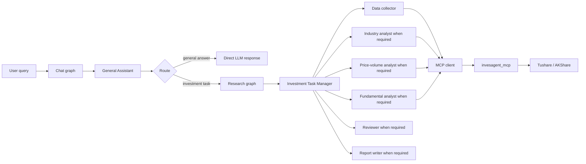

# InvesAgent

English | [Chinese](README.zh-CN.md)

InvesAgent is a local financial data and research-agent project. It is organized as two independent packages:

```text
InvesAgent/
  invesagent_mcp/     # Standalone MCP server + embedded finance core
  invesagent_agent/   # LangGraph chat router, research agents, and workflow
```

> Disclaimer: This project is for data analysis, engineering practice, and learning only. It does not provide investment advice.

## What It Does

- Exposes financial data and analytics as MCP tools.
- Supports Tushare and AKShare data providers.
- Fetches OHLCV, valuation, fundamentals, trading calendar, industry list, and industry members.
- Generates configurable price charts.
- Runs a LangGraph chat workflow with a General Assistant before tool use.
- Calls the investment research workflow and MCP tools only when the latest user input is a data-backed financial research task.
- Uses an Investment Task Manager to decide which specialist agents should run.
- Uses role-specific prompts for price-volume analysis, fundamental analysis, industry analysis, review, and report writing.

## Package Roles

`invesagent_mcp` is the standalone MCP server. It embeds the finance core, so it can be copied and installed independently:

```text
invesagent_mcp/src/
  invesagent_core/    # models, providers, services, metrics, charts, storage, config
  invesagent_mcp/     # MCP server and MCP tool registration
```

`invesagent_agent` contains the Agent side:

```text
invesagent_agent/src/invesagent_agent/
  agents/             # LangGraph node implementations
  clients/            # MCP client and OpenAI-compatible LLM client
  prompts/            # role-specific prompts
  schemas/            # structured planning / analyst / review outputs
  workflows/          # chat graph, research graph, and CLI runner
  runners/            # console-script entrypoints
```

The Agent package calls the MCP server through `invesagent_agent.clients.mcp_client`. It does not import `invesagent_core` directly.

## Current MCP Tools

The MCP server currently exposes 15 tools:

```text
health_check
get_project_info
resolve_instrument_tool
get_ohlcv_tool
analyze_ohlcv_price_trend_tool
generate_ohlcv_price_chart_tool
get_trade_calendar_tool
get_valuation_tool
analyze_valuation_tool
get_fundamentals_tool
analyze_fundamentals_tool
compare_ohlcv_with_benchmark_tool
compare_ohlcv_instruments_tool
list_industries_tool
get_industry_members_tool
```

## Install

```powershell
cd <PROJECT_ROOT>
pip install -e invesagent_mcp -e invesagent_agent
```

## Configuration

Create a single `.env` in the project root by copying `.env.example`:

```text
TUSHARE_TOKEN=your_tushare_token

LLM_PROVIDER=deepseek
DEEPSEEK_API_KEY=your_deepseek_api_key
DEEPSEEK_BASE_URL=https://api.deepseek.com
DEEPSEEK_MODEL=deepseek-chat

OPENAI_API_KEY=your_openai_api_key
OPENAI_BASE_URL=https://api.openai.com/v1
OPENAI_MODEL=gpt-4.1-mini

LLM_RECORD_USAGE=true
LLM_PROMPT_CACHE=auto
```

Only the project-root `.env` is loaded. Provider-specific settings such as
`OPENAI_MODEL` and `DEEPSEEK_MODEL` are preferred; legacy `LLM_MODEL` and
`LLM_BASE_URL` remain available as fallback overrides.

## Run MCP

stdio:

```powershell
cd <PROJECT_ROOT>/invesagent_mcp
python -m invesagent_mcp.server --transport stdio
```

Streamable HTTP:

```powershell
cd <PROJECT_ROOT>/invesagent_mcp
python -m invesagent_mcp.server --transport streamable-http --host 127.0.0.1 --port 8000 --path /mcp
```

## Run Chat / Research Workflow

The default runner first routes user input through the General Assistant. Casual chat and finance concept explanations do not call tools. Investment tasks are passed to the Investment Task Manager, which may answer directly, ask for clarification, or generate a task plan for specialist agents. Clear data-backed requests enter the MCP-backed research workflow.

```powershell
cd <PROJECT_ROOT>
python -m invesagent_agent.workflows.runner "hello" --show-intent
python -m invesagent_agent.workflows.runner "What is DCF?" --show-intent
python -m invesagent_agent.workflows.runner "Analyze Luzhou Laojiao from 2024-01-01 to 2024-01-31" --show-intent
```

Optional multi-turn CLI history:

```powershell
python -m invesagent_agent.workflows.runner "Analyze the liquor industry" --history-file .invesagent_chat_history.json
python -m invesagent_agent.workflows.runner "Use 2024 and focus on price-volume" --history-file .invesagent_chat_history.json
```

## Architecture



## Documentation

- [MCP client configuration](docs/mcp_client_config.md)
- [Migration notes](docs/legacy_migration.md)
- [Agent workflow design](docs/architecture/agent_workflow_design.md)
