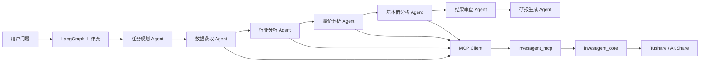

# InvesAgent

[English](README.md) | 中文

InvesAgent 是一个本地金融数据与研究 Agent 项目。当前项目拆分为两个相互独立但可以协同工作的包：

```text
InvesAgent/
  invesagent_mcp/     # 独立 MCP Server + 内置金融核心
  invesagent_agent/   # LangGraph 研究 Agent 与工作流
```

> 免责声明：本项目仅用于数据分析、工程实践和学习，不构成任何投资建议。

## 项目能力

- 将金融数据获取、分析和图表能力暴露为 MCP 工具。
- 支持 Tushare 与 AKShare 数据源。
- 支持 OHLCV 行情、估值、基本面、交易日历、行业列表、行业成分股。
- 支持可配置价格图表生成。
- 通过 MCP Client 让 LangGraph 工作流调用独立 MCP Server。
- 为任务规划、量价分析、基本面分析、行业分析、研报生成、结果审查配置独立角色提示词。

## 两个包的职责

`invesagent_mcp` 是独立 MCP Server。它内置金融核心，因此可以单独复制、安装和运行：

```text
invesagent_mcp/src/
  invesagent_core/    # models、providers、services、metrics、charts、storage、config
  invesagent_mcp/     # MCP server 与 MCP tools 注册
```

`invesagent_agent` 是 Agent 侧：

```text
invesagent_agent/src/invesagent_agent/
  agents/             # LangGraph 节点实现
  clients/            # MCP Client 与 OpenAI-compatible LLM Client
  prompts/            # 各角色独立提示词
  schemas/            # 任务规划、分析、审查的结构化输出
  workflows/          # LangGraph 工作流与命令行入口
  runners/            # console script 入口
```

Agent 包通过 `invesagent_agent.clients.mcp_client` 调用 MCP Server，不直接 import `invesagent_core`。

## 当前 MCP 工具

当前 MCP Server 暴露 15 个工具：

```text
health_check
get_project_info
resolve_instrument_tool
get_ohlcv_tool
analyze_ohlcv_price_trend_tool
generate_ohlcv_price_chart_tool
get_trade_calendar_tool
get_valuation_tool
analyze_valuation_tool
get_fundamentals_tool
analyze_fundamentals_tool
compare_ohlcv_with_benchmark_tool
compare_ohlcv_instruments_tool
list_industries_tool
get_industry_members_tool
```

## 安装

推荐在项目根目录同时安装两个包：

```powershell
cd <PROJECT_ROOT>
pip install -e invesagent_mcp -e invesagent_agent
```

也可以分别安装：

```powershell
cd <PROJECT_ROOT>/invesagent_mcp
pip install -e .

cd <PROJECT_ROOT>/invesagent_agent
pip install -e .
```

## 配置

两个子包均提供 `.env.example`。

如果需要 MCP 获取真实数据，可以创建 `invesagent_mcp/.env` 或项目根目录 `.env`：

```text
TUSHARE_TOKEN=your_tushare_token
```

如果需要启用 LLM Agent 节点，可以创建 `invesagent_agent/.env` 或项目根目录 `.env`：

```text
LLM_PROVIDER=deepseek
LLM_BASE_URL=https://api.deepseek.com
LLM_MODEL=deepseek-v4-flash
DEEPSEEK_API_KEY=your_deepseek_api_key
```

如果没有配置 LLM，工作流仍可在确定性降级模式下运行，但 LLM 推理、报告写作和审查能力会受到限制。

## 启动 MCP

stdio：

```powershell
cd <PROJECT_ROOT>/invesagent_mcp
python -m invesagent_mcp.server --transport stdio
```

Streamable HTTP：

```powershell
cd <PROJECT_ROOT>/invesagent_mcp
python -m invesagent_mcp.server --transport streamable-http --host 127.0.0.1 --port 8000 --path /mcp
```

## 运行 LangGraph 工作流

公司研究：

```powershell
cd <PROJECT_ROOT>
python -m invesagent_agent.workflows.runner "请分析泸州老窖 2022-01-01 到 2024-12-31 的量价表现和基本面" --industry-member-limit 3
```

行业研究：

```powershell
cd <PROJECT_ROOT>
python -m invesagent_agent.workflows.runner "请分析白酒行业 2024-01-01 到 2024-01-31 的主要公司量价表现和基本面" --industry-member-limit 3
```

## 架构



## 文档

- [MCP 客户端配置](docs/mcp_client_config.md)
- [旧结构迁移说明](docs/legacy_migration.md)
- [Agent 工作流设计](docs/architecture/agent_workflow_design.md)
