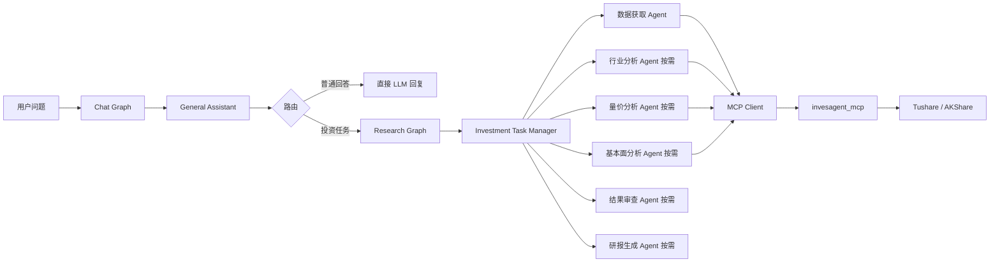

# InvesAgent

[English](README.md) | 中文

InvesAgent 是一个本地金融数据与投资研究 Agent 项目。当前项目拆分为两个相互独立但可协同工作的包：

```text
InvesAgent/
  invesagent_mcp/     # 独立 MCP Server + 内置金融核心
  invesagent_agent/   # LangGraph 对话入口、投资任务管理和研究 Agent
```

> 免责声明：本项目仅用于数据分析、工程实践和学习，不构成任何投资建议。

## 项目能力

- 将金融数据获取、分析计算和图表能力暴露为 MCP 工具。
- 支持 Tushare 和 AKShare 数据源。
- 支持 OHLCV 行情、估值、基本面、交易日历、行业列表、行业成分股。
- 支持可配置价格图表生成。
- 在调用工具前先通过 General Assistant 判断最新用户输入是否需要进入投资研究系统。
- 普通聊天和金融概念解释不会调用 MCP 工具。
- 投资研究任务会交给 Investment Task Manager 生成 `task_plan`，再按需分派专业 Agent。
- 支持量价分析、基本面分析、行业分析、结果审查和报告生成等角色化节点。

## 两个包的职责

`invesagent_mcp` 是独立 MCP Server。它内置金融核心，因此可以单独复制、安装和运行：

```text
invesagent_mcp/src/
  invesagent_core/    # models、providers、services、metrics、charts、storage、config
  invesagent_mcp/     # MCP server 与 MCP tools 注册
```

`invesagent_agent` 是 Agent 侧：

```text
invesagent_agent/src/invesagent_agent/
  agents/             # LangGraph 节点实现
  clients/            # MCP Client 与 OpenAI-compatible LLM Client
  prompts/            # 各角色独立提示词
  schemas/            # 任务规划、分析和审查的结构化输出
  workflows/          # chat graph、research graph 与命令行入口
  runners/            # console script 入口
```

Agent 包通过 `invesagent_agent.clients.mcp_client` 调用 MCP Server，不直接 import `invesagent_core`。

## 当前 MCP 工具

当前 MCP Server 暴露 15 个工具：

```text
health_check
get_project_info
resolve_instrument_tool
get_ohlcv_tool
analyze_ohlcv_price_trend_tool
generate_ohlcv_price_chart_tool
get_trade_calendar_tool
get_valuation_tool
analyze_valuation_tool
get_fundamentals_tool
analyze_fundamentals_tool
compare_ohlcv_with_benchmark_tool
compare_ohlcv_instruments_tool
list_industries_tool
get_industry_members_tool
```

## 安装

```powershell
cd <PROJECT_ROOT>
pip install -e invesagent_mcp -e invesagent_agent
```

## 配置

复制根目录 `.env.example` 为项目根目录 `.env`，所有子模块只读取这一份配置：

```text
TUSHARE_TOKEN=your_tushare_token

LLM_PROVIDER=deepseek
DEEPSEEK_API_KEY=your_deepseek_api_key
DEEPSEEK_BASE_URL=https://api.deepseek.com
DEEPSEEK_MODEL=deepseek-chat

OPENAI_API_KEY=your_openai_api_key
OPENAI_BASE_URL=https://api.openai.com/v1
OPENAI_MODEL=gpt-4.1-mini

LLM_RECORD_USAGE=true
LLM_PROMPT_CACHE=auto
```

优先使用 `OPENAI_MODEL`、`DEEPSEEK_MODEL` 等 provider 专属配置；旧的
`LLM_MODEL`、`LLM_BASE_URL` 仍作为兼容 fallback。

## 启动 MCP

stdio：

```powershell
cd <PROJECT_ROOT>/invesagent_mcp
python -m invesagent_mcp.server --transport stdio
```

Streamable HTTP：

```powershell
cd <PROJECT_ROOT>/invesagent_mcp
python -m invesagent_mcp.server --transport streamable-http --host 127.0.0.1 --port 8000 --path /mcp
```

## 运行聊天 / 研究工作流

默认入口会先由 General Assistant 判断用户最新输入。普通聊天和金融概念解释不会调用工具；投资任务会交给 Investment Task Manager 判断是否需要追问、是否需要工具、以及需要哪些专业 Agent。

```powershell
cd <PROJECT_ROOT>
python -m invesagent_agent.workflows.runner "你好" --show-intent
python -m invesagent_agent.workflows.runner "DCF 是什么" --show-intent
python -m invesagent_agent.workflows.runner "贵州茅台 2024-01-01 到 2024-01-31 股票价格走势怎么样" --show-intent
```

可选的命令行多轮历史：

```powershell
python -m invesagent_agent.workflows.runner "帮我分析一下白酒行业" --history-file .invesagent_chat_history.json
python -m invesagent_agent.workflows.runner "看 2024 年，重点看量价" --history-file .invesagent_chat_history.json
```

## 架构



## 文档

- [MCP 客户端配置](docs/mcp_client_config.md)
- [旧结构迁移说明](docs/legacy_migration.md)
- [Agent 工作流设计](docs/architecture/agent_workflow_design.md)
